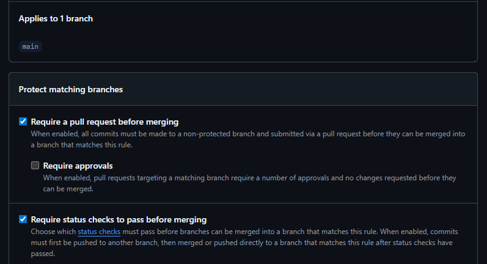

# Projeto Individual: Currículo Online DS881

Este repositório é uma atividade prática individual da disciplina DS881. O objetivo é aplicar conceitos de conteinerização, automação de pipeline CI/CD e governança de código em um cenário de projeto real.

## Proteção de Branch

A branch `main` foi configurada para não aceitar commits diretos e para apenas permitir o merge se pipeline de CI estiver com status "verde" (sucesso).

